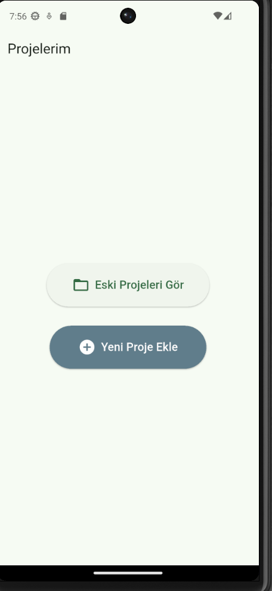
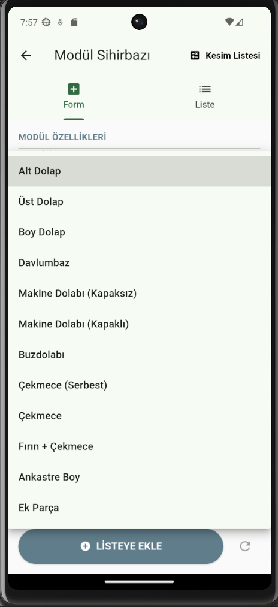
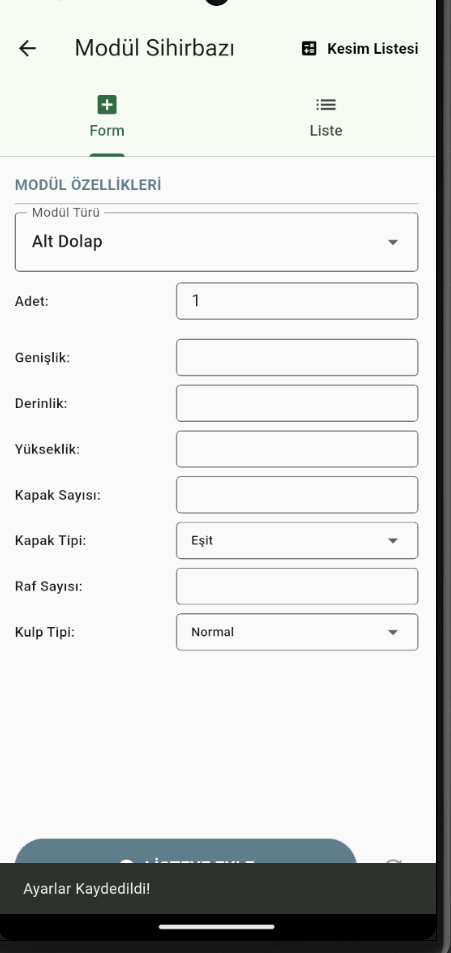
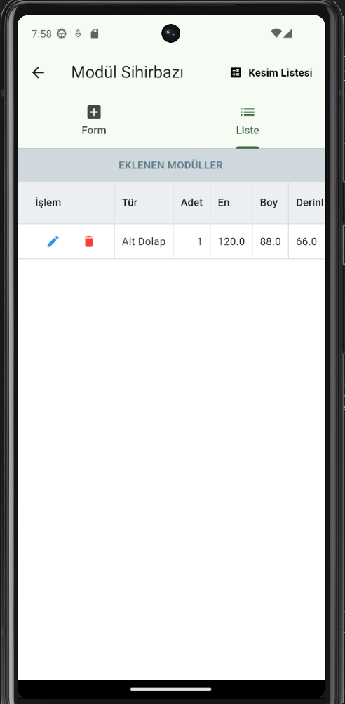
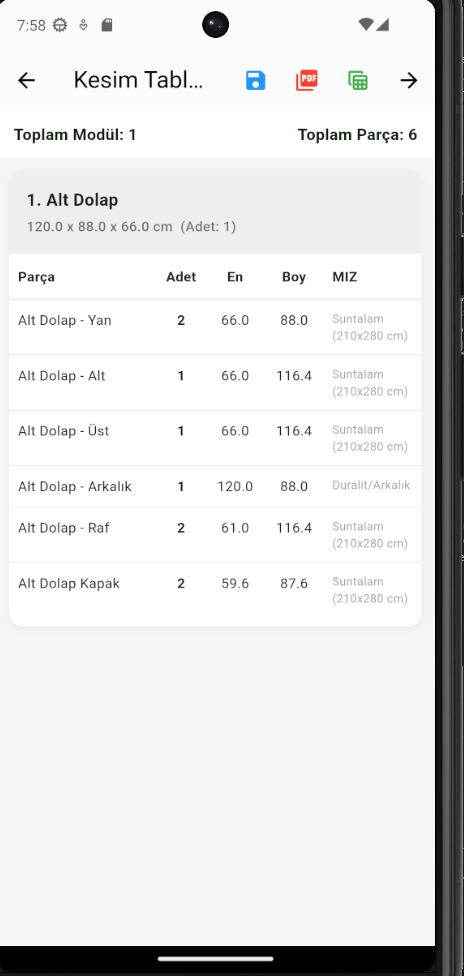
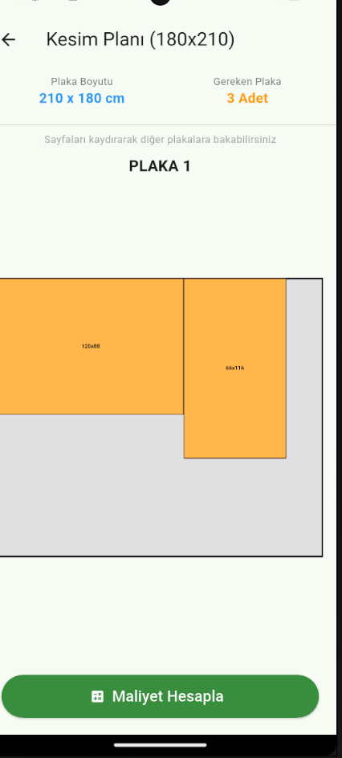
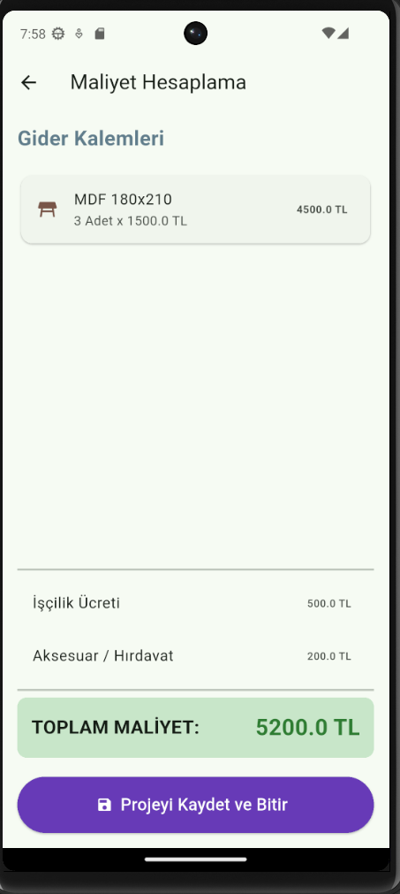
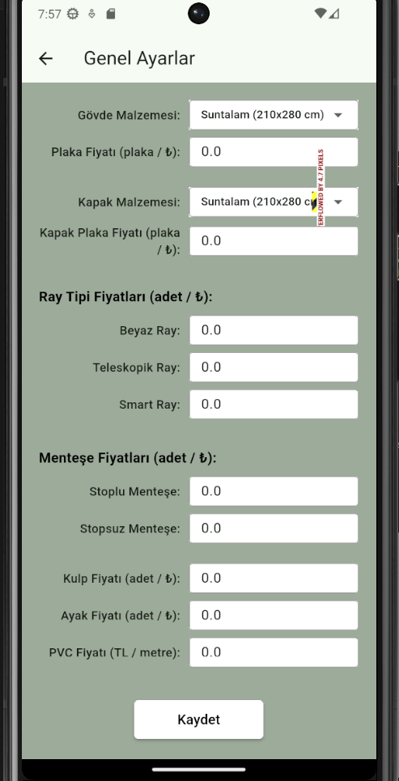
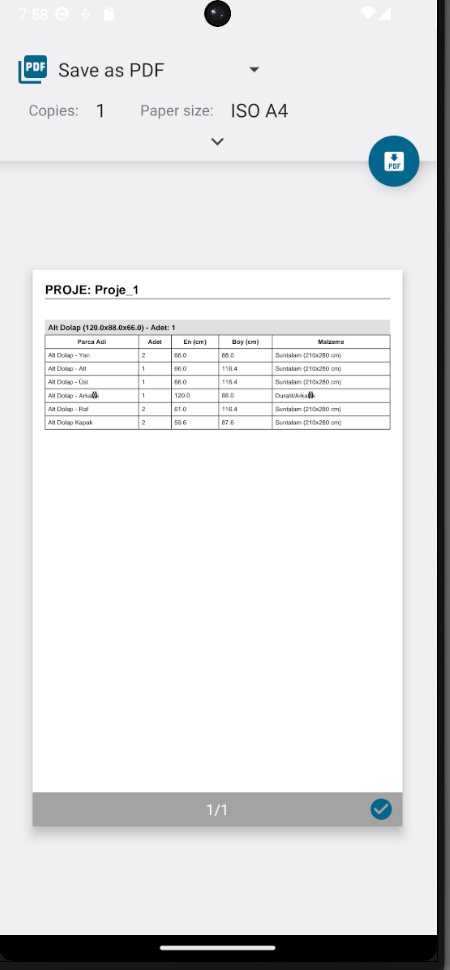
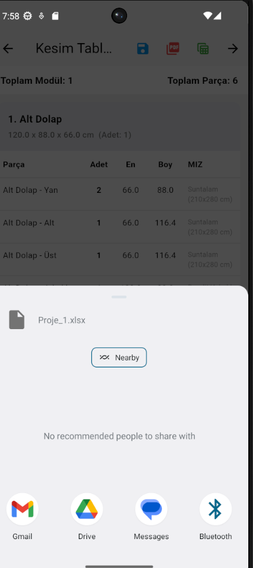

# 🪑 Mobilya Kesim & Maliyet Hesaplama Uygulaması

Bu proje, mobilya üreticileri, marangozlar ve hobi amaçlı kullanıcılar için geliştirilmiş kapsamlı bir **Modül Hesaplama, Kesim Optimizasyonu ve Maliyet Analizi** uygulamasıdır. Flutter ve Firebase altyapısı kullanılarak geliştirilmiştir.

Uygulama, kullanıcıların mutfak dolabı, gardırop gibi mobilya modüllerini parametrik ölçülerle girmesine, otomatik olarak detaylı parça listelerini oluşturmasına, plaka optimizasyonu yapmasına ve anlık maliyet hesabı çıkarmasına olanak tanır.

## 🚀 Öne Çıkan Özellikler

* **Kullanıcı Yönetimi:** Güvenli giriş ve kullanıcıya özel proje saklama.
* **Akıllı Modül Sihirbazı:** Alt/üst dolap, çekmece, boy dolap gibi hazır şablonlar.
* **Dinamik Hesaplama:** Girilen En/Boy/Derinlik verilerine göre tüm parçaların (yan dikme, kapak, raf, arkalık vb.) milimetrik hesabı.
* **Proje Yönetimi:** Eski projeleri listeleme, güncelleme ve silme.
* **Kesim Optimizasyonu:** Plaka firesini en aza indiren yerleşim planı (Cutting Optimization).
* **Maliyet Analizi:** Malzeme m², aksesuar, işçilik ve kenar bandı giderleri ile toplam maliyet.
* **Raporlama:** Tek tıkla **PDF** dökümü alma ve **Excel** (.xlsx) çıktısı oluşturma.

## 📱 Uygulama Görselleri

### 1. Giriş ve Proje Yönetimi
Kullanıcı dostu giriş ekranı ve projelerin yönetildiği ana paneller.

| Giriş Ekranı | Ana Sayfa | Kayıtlı Projeler |
|:---:|:---:|:---:|
|  |  |  |

### 2. Modül Oluşturma Süreci
Geniş modül kütüphanesi ve parametrik veri giriş ekranları.

| Modül Seçimi | Ölçü Girişi (Form) | Eklenenler Listesi |
|:---:|:---:|:---:|
|  |  |  |

### 3. Hesaplama ve Optimizasyon
Otomatik oluşturulan kesim listesi, plaka yerleşim planı ve maliyet tablosu.

| Kesim Listesi | Optimizasyon Planı | Maliyet Hesabı |
|:---:|:---:|:---:|
|  |  |  |

### 4. Ayarlar ve Çıktı Alma
Malzeme birim fiyat ayarları ve Excel/PDF dışa aktarma özellikleri.

| Fiyat Ayarları | PDF Önizleme | Excel Çıktısı |
|:---:|:---:|:---:|
|  |  |  |

## 🛠 Teknik Altyapı

* **Dil:** Dart
* **Framework:** Flutter
* **Backend:** Firebase (Authentication & Firestore)
* **State Management:** Provider
* **Yerel Depolama:** Hive (Ayarlar için)
* **PDF:** `pdf` ve `printing` paketleri
* **Excel:** `excel` paketi

## 📦 Kurulum

Bu projeyi yerel ortamınızda incelemek ve geliştirmek için:

1.  Repoyu klonlayın:
    ```bash
    git clone (https://github.com/betulgurleyen/Mobilya-Maliyet-ve-Kesim-Asistan-Proje-Planlamas-.git)
    ```
2.  Proje dizinine gidin ve paketleri yükleyin:
    ```bash
    cd modul_app
    flutter pub get
    ```
3.  **Önemli Not:** Proje Firebase servislerini kullanmaktadır. Çalıştırmak için kendi Firebase yapılandırmanızı (firebase_options.dart veya google-services.json) eklemeniz gerekmektedir.
4.  Uygulamayı başlatın:
    ```bash
    flutter run
    ```


*Geliştiriciler: Ebrar Doğan / Saliha Betül Gürleyen*